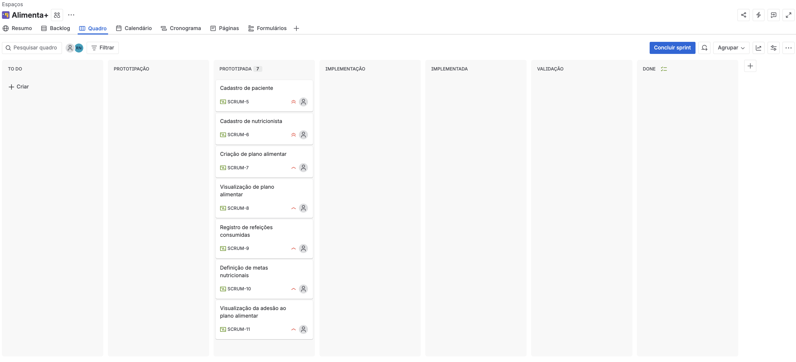
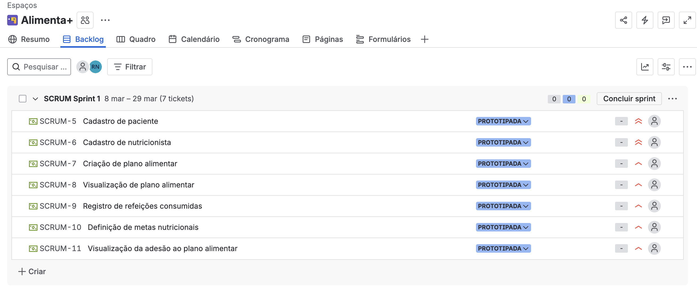
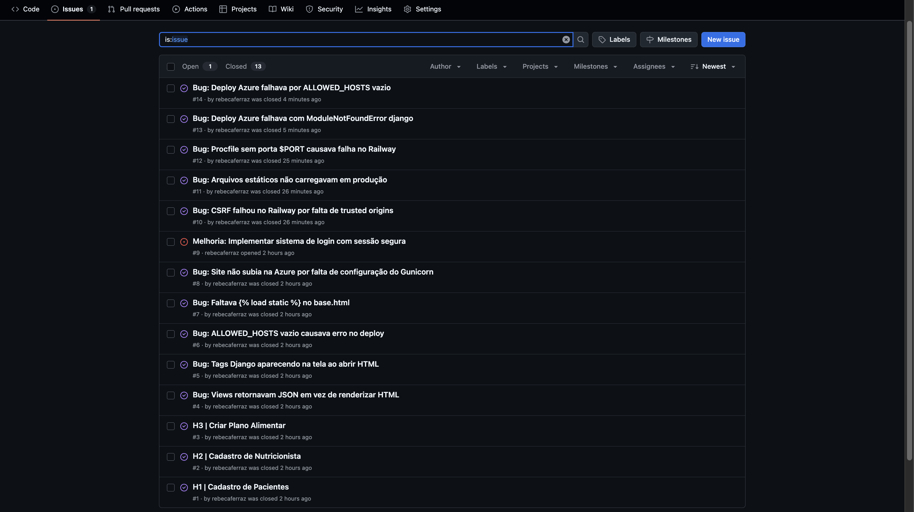
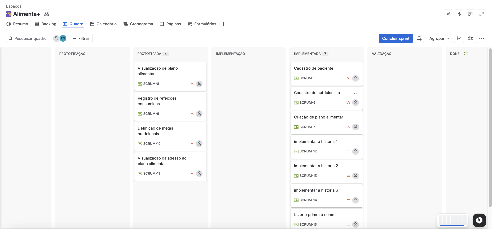
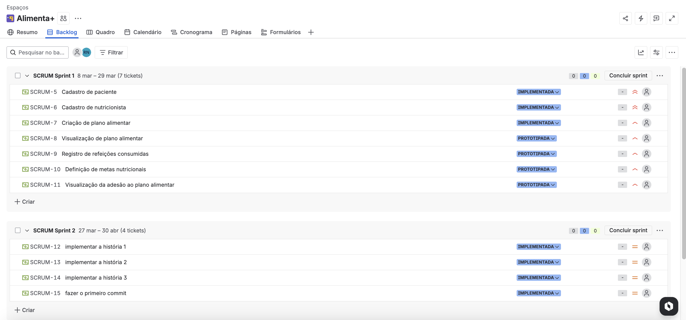

# Alimenta+ 

Aplicação web para gestão nutricional que conecta nutricionistas e pacientes, focada em auxiliar a adesão ao plano alimentar e monitoramento de metas.

# 👥 Equipe

<table>
  <tr>
    <td align="center"><a href="https://github.com/Lauravi354"><b>Laura Alves</b></a></td>
    <td align="center"><a href="https://github.com/luisamagalhaess"><b>Luísa Magalhães</b></a></td>
    <td align="center"><a href="https://github.com/malucoelho"><b>Maria Luiza Coelho</b></a></td>
  </tr>
  <tr>
    <td align="center"><a href="https://github.com/PedroOliveiira"><b>Pedro Oliveira</b></a></td>
    <td align="center"><a href="https://github.com/rebecaferraz"><b>Rebeca Ferraz</b></a></td>
    <td align="center"><a href="https://github.com/vfmns-arch"><b>Vinícius Souza</b></a></td>
  </tr>
</table>

## 📋 Entregas

### Entrega 01 | Histórias de Usuário e Protótipo Lo-Fi

#### 📄 Histórias de Usuário
[Clique aqui para acessar o documento de histórias de usuário](https://docs.google.com/document/d/1L_HgO1RpaM8HjgqgyjmdYe_5D2p69a1GbW1iN-cltrA/edit?usp=sharing)

#### 🎨 Protótipo Lo-Fi (Figma)
[Clique aqui para acessar o protótipo Lo-Fi no Figma](https://www.figma.com/community/file/1612289552402822938/lo-fi-login-cadastro-de-paciente)

#### 🎥 Screencast do Protótipo Lo-Fi
[Clique aqui para acessar o screencast do Protótipo Lo-Fi](https://www.youtube.com/watch?v=oniXMrVcW00)

#### 📌 Quadro da Sprint (JIRA)

#### 📋 Backlog do Produto (JIRA)

#### 🗂️ JIRA
[Clique aqui para acessar o JIRA](https://cesar-team-ko4t55oe.atlassian.net/jira/software/projects/SCRUM/boards/1)

### Entrega 02 | Implementação e Deploy
 
#### 🖥️ Histórias Implementadas
- H1: Cadastro de Paciente
- H2: Cadastro de Nutricionista
- H3: Criar Plano Alimentar
 
#### 🌐 Deploy em Produção (Azure)
[alimentamais.azurewebsites.net](http://alimentamais.azurewebsites.net)

**Instruções de acesso:**
1. Acesse o link acima
2. Clique em "Criar conta" para se cadastrar como paciente ou nutricionista
3. Após o cadastro, faça login com seu e-mail e senha
4. Nutricionistas podem criar planos alimentares para os pacientes cadastrados

#### 🎥 Screencast do Sistema
*(Link do YouTube a ser adicionado)*
 
#### 🔀 Programação em Par
A programação em par foi realizada durante calls no Discord, onde uma integrante atuava como driver (Malu) e outra como navigator (Rebeca).

*De baixo para cima: Malu Coelho(teamomuit...) e Rebeca Ferraz (Nyx)*
 
#### 🐛 Issue/Bug Tracker (GitHub)

 
#### 📌 Quadro da Sprint 02 (JIRA)

 
#### 📋 Backlog Atualizado (JIRA)

## 🛠️ Tecnologias
 
- **Back-end:** Python + Django
- **Banco de dados:** SQLite (desenvolvimento) / PostgreSQL (produção)
- **Front-end:** HTML, CSS, JavaScript
- **Deploy:** Azure
- **Versionamento:** Git + GitHub
