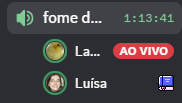
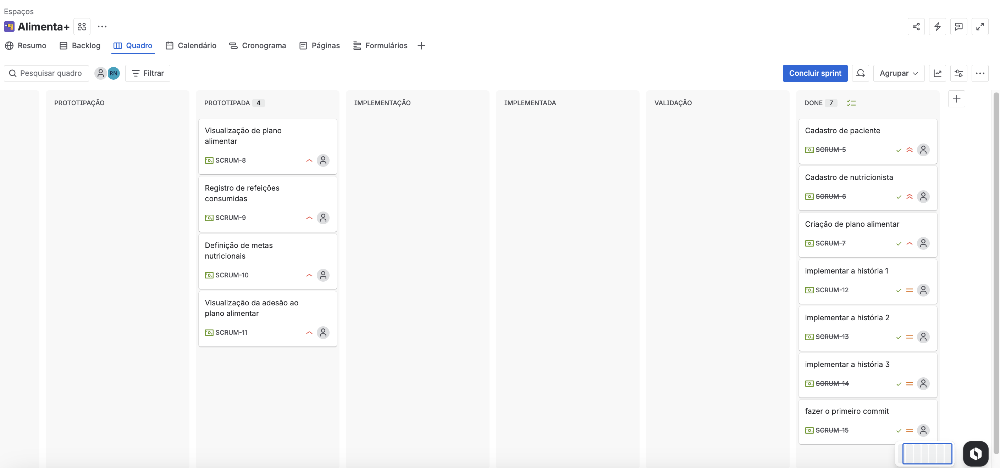
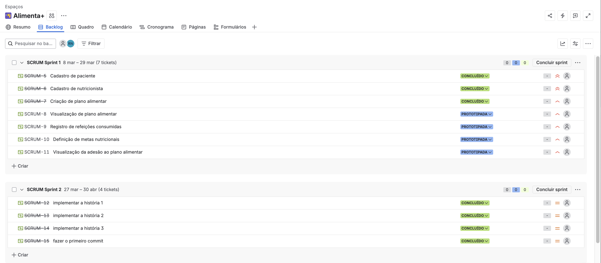

# Alimenta+ 
Aplicação web para gestão nutricional que conecta nutricionistas e pacientes, focada em auxiliar a adesão ao plano alimentar e monitoramento de metas.

# 👥 Equipe
<table>
  <tr>
    <td align="center"><a href="https://github.com/Lauravi354"><b>Laura Alves</b></a></td>
    <td align="center"><a href="https://github.com/luisamagalhaess"><b>Luísa Magalhães</b></a></td>
    <td align="center"><a href="https://github.com/malucoelho"><b>Maria Luiza Coelho</b></a></td>
  </tr>
  <tr>
    <td align="center"><a href="https://github.com/PedroOliveiira"><b>Pedro Oliveira</b></a></td>
    <td align="center"><a href="https://github.com/rebecaferraz"><b>Rebeca Ferraz</b></a></td>
    <td align="center"><a href="https://github.com/vfmns-arch"><b>Vinícius Souza</b></a></td>
  </tr>
</table>

## 📋 Entregas

Entrega 01 | Histórias de Usuário e Protótipo Lo-Fi

#### 📄 Histórias de Usuário
[Clique aqui para acessar o documento de histórias de usuário](https://docs.google.com/document/d/1L_HgO1RpaM8HjgqgyjmdYe_5D2p69a1GbW1iN-cltrA/edit?usp=sharing)

#### 🎨 Protótipo Lo-Fi (Figma)
[Clique aqui para acessar o protótipo Lo-Fi no Figma](https://www.figma.com/community/file/1612289552402822938/lo-fi-login-cadastro-de-paciente)

#### 🎥 Screencast do Protótipo Lo-Fi
[Clique aqui para acessar o screencast do Protótipo Lo-Fi](https://www.youtube.com/watch?v=oniXMrVcW00)

#### 📌 Quadro da Sprint (JIRA)

#### 📋 Backlog do Produto (JIRA)

#### 🗂️ JIRA
[Clique aqui para acessar o JIRA](https://cesar-team-ko4t55oe.atlassian.net/jira/software/projects/SCRUM/boards/1)

Entrega 02 | Implementação e Deploy

#### 🖥️ Histórias Implementadas
- H1: Cadastro de Paciente
- H2: Cadastro de Nutricionista
- H3: Criar Plano Alimentar

#### 🌐 Deploy em Produção (Azure)
[alimentamais.azurewebsites.net](http://alimentamais.azurewebsites.net)

**Instruções de acesso:**
1. Acesse o link acima
2. Clique em "Criar conta" para se cadastrar como paciente ou nutricionista
3. Após o cadastro, faça login com seu e-mail e senha
4. Nutricionistas podem criar planos alimentares para os pacientes cadastrados

#### 🎥 Screencast do Sistema
[Clique aqui para acessar o screencast das Histórias 1, 2 e 3 Implementadas](https://youtu.be/0gu0yG1TrSc)

#### 🔀 Programação em Par

A programação em par foi realizada durante calls no Discord ao longo da sprint.

**Dupla 1 — Malu Coelho (driver) e Rebeca Ferraz (navigator)**
Durante a call, Malu implementou a view de cadastro de paciente (H1) enquanto Rebeca acompanhava o código em tempo real, identificando um erro na validação do e-mail duplicado e sugerindo a correção. Juntas também revisaram o models.py para garantir que os campos de saúde estavam corretos.

**Dupla 2 — Luísa Magalhães (driver) e Laura Vitória (navigator)**
Luísa trabalhou na view de cadastro de nutricionista (H2) com Laura orientando a estrutura da validação do CRN. Laura identificou que o erro de CRN duplicado não estava sendo tratado corretamente e sugeriu o ajuste na lógica da view. As duas também revisaram juntas o template de cadastro para garantir que o seletor de tipo (paciente/nutricionista) estava funcionando corretamente.

*Print 1: Malu Coelho (teamomuit...) e Rebeca Ferraz (Nyx)*
*Print 2: Luísa Magalhães (Luísa) e Laura Vitória (La...)*
#### 🐛 Issue/Bug Tracker (GitHub)

#### 📌 Quadro da Sprint 02 (JIRA)

#### 📋 Backlog Atualizado (JIRA)

Entrega 03 | Novas Histórias, CI/CD e Testes

  
#### 🖥️ Histórias Implementadas
- H4: Visualizar Plano Alimentar
- H5: Registrar Refeição Consumida
- H6: Definir Metas Nutricionais

#### 🌐 Deploy em Produção
[alimentamais.azurewebsites.net](http://alimentamais.azurewebsites.net)

#### 🎥 Screencast das Novas Histórias
*(Link do YouTube a ser adicionado)*

#### ⚙️ CI/CD
*(Link do pipeline no GitHub)*

#### 🎥 Screencast dos Testes E2E
*(Link do YouTube a ser adicionado)*

#### 🔀 Programação em Par
*(Relato atualizado)*

#### 🐛 Issue/Bug Tracker
*(Print)*

#### 📌 Quadro da Sprint 03 (JIRA)
*(Print)*

## 🛠️ Tecnologias
- **Back-end:** Python + Django
- **Banco de dados:** SQLite (desenvolvimento) / PostgreSQL (produção)
- **Front-end:** HTML, CSS, JavaScript
- **Deploy:** Azure
- **Versionamento:** Git + GitHub
